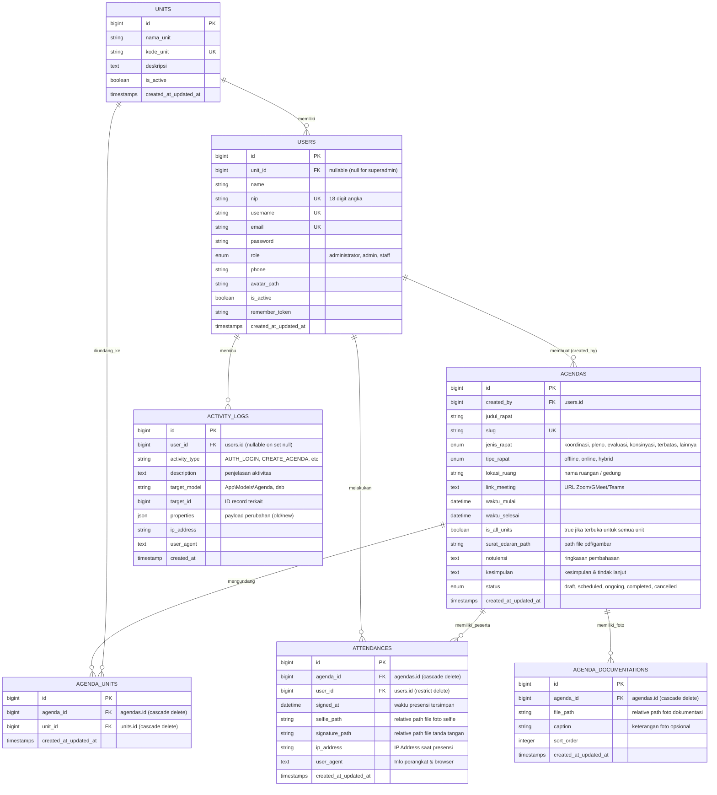

# Entity Relationship Diagram & Data Dictionary (ERD)
## Sistem Pencatatan Kehadiran Rapat Berbasis Web (SIPERAPAT)
**Instansi:** Lembaga Layanan Pendidikan Tinggi (LLDIKTI)  
**Database Engine:** MySQL 8.0+ / PostgreSQL 15+ / SQLite 3.35+  
**Versi Dokumen:** 1.0.0  

---

## 1. Visual Entity Relationship Diagram (Mermaid)



---

## 2. Kamus Data & Spesifikasi Tabel Terperinci

### 2.1. Tabel `units` (Unit Kerja / Bagian / Pokja)
Menyimpan data unit organisasi internal di lingkungan LLDIKTI.

| Nama Kolom | Tipe Data | Nullable | Default | Keterangan & Aturan Validasi |
| :--- | :--- | :---: | :---: | :--- |
| `id` | `BIGINT UNSIGNED` | No | AUTO_INCREMENT | Primary Key |
| `nama_unit` | `VARCHAR(150)` | No | - | Nama resmi unit (misal: *Pokja Kelembagaan*) |
| `kode_unit` | `VARCHAR(30)` | No | - | Kode unik unit (misal: `POKJA-KLB`), **UNIQUE INDEX** |
| `deskripsi` | `TEXT` | Yes | NULL | Keterangan tugas fungsi unit (opsional) |
| `is_active` | `BOOLEAN` | No | `true` | Status keaktifan unit |
| `created_at` | `TIMESTAMP` | Yes | NULL | Waktu pembuatan |
| `updated_at` | `TIMESTAMP` | Yes | NULL | Waktu pembaruan terakhir |

---

### 2.2. Tabel `users` (Aparatur / Pegawai / Administrator)
Menyimpan kredensial dan profil seluruh pegawai dan pengelola sistem.

| Nama Kolom | Tipe Data | Nullable | Default | Keterangan & Aturan Validasi |
| :--- | :--- | :---: | :---: | :--- |
| `id` | `BIGINT UNSIGNED` | No | AUTO_INCREMENT | Primary Key |
| `unit_id` | `BIGINT UNSIGNED` | Yes | NULL | Foreign Key ke `units.id` (`ON DELETE SET NULL`) |
| `name` | `VARCHAR(150)` | No | - | Nama lengkap beserta gelar akademik/kedinasan |
| `nip` | `VARCHAR(30)` | No | - | Nomor Induk Pegawai 18 digit, **UNIQUE INDEX** |
| `username` | `VARCHAR(50)` | No | - | Username alfanumerik, **UNIQUE INDEX** |
| `email` | `VARCHAR(100)` | No | - | Alamat email resmi (untuk reset password), **UNIQUE INDEX** |
| `password` | `VARCHAR(255)` | No | - | Hash password (Bcrypt / Argon2id) |
| `role` | `ENUM` | No | `'staff'` | Pilihan: `'administrator'`, `'admin'`, `'staff'` |
| `phone` | `VARCHAR(20)` | Yes | NULL | Nomor kontak WhatsApp/telepon |
| `avatar_path` | `VARCHAR(255)` | Yes | NULL | Path foto profil (opsional) |
| `is_active` | `BOOLEAN` | No | `true` | Status akun aktif/non-aktif |
| `remember_token` | `VARCHAR(100)` | Yes | NULL | Token Remember Me Laravel |
| `created_at` | `TIMESTAMP` | Yes | NULL | Waktu pembuatan |
| `updated_at` | `TIMESTAMP` | Yes | NULL | Waktu pembaruan terakhir |

---

### 2.3. Tabel `agendas` (Agenda & Pertemuan Rapat)
Menyimpan metadata agenda rapat, surat edaran, notulensi, dan kesimpulan.

| Nama Kolom | Tipe Data | Nullable | Default | Keterangan & Aturan Validasi |
| :--- | :--- | :---: | :---: | :--- |
| `id` | `BIGINT UNSIGNED` | No | AUTO_INCREMENT | Primary Key |
| `created_by` | `BIGINT UNSIGNED` | No | - | Foreign Key ke `users.id` pembuat agenda |
| `judul_rapat` | `VARCHAR(255)` | No | - | Judul atau perihal pertemuan rapat |
| `slug` | `VARCHAR(255)` | No | - | Slug URL unik ramah SEO/routing, **UNIQUE INDEX** |
| `jenis_rapat` | `ENUM` | No | `'koordinasi'` | `'koordinasi'`, `'pleno'`, `'evaluasi'`, `'konsinyasi'`, `'terbatas'`, `'lainnya'` |
| `tipe_rapat` | `ENUM` | No | `'offline'` | `'offline'`, `'online'`, `'hybrid'` |
| `lokasi_ruang` | `VARCHAR(150)` | Yes | NULL | Nama ruang rapat / gedung (wajib jika offline/hybrid) |
| `link_meeting` | `TEXT` | Yes | NULL | URL tautan daring (Zoom/GMeet/Teams) |
| `waktu_mulai` | `DATETIME` | No | - | Jadwal mulai pelaksanaan rapat |
| `waktu_selesai` | `DATETIME` | No | - | Jadwal estimasi selesai rapat |
| `is_all_units` | `BOOLEAN` | No | `true` | Jika `true`, seluruh unit berhak hadir |
| `surat_edaran_path` | `VARCHAR(255)` | Yes | NULL | Path berkas surat edaran / undangan rapat (PDF/JPG) |
| `notulensi` | `LONGTEXT` | Yes | NULL | Catatan jalannya rapat & pembahasan |
| `kesimpulan` | `LONGTEXT` | Yes | NULL | Poin kesimpulan dan rencana tindak lanjut (RTL) |
| `status` | `ENUM` | No | `'scheduled'` | `'draft'`, `'scheduled'`, `'ongoing'`, `'completed'`, `'cancelled'` |
| `created_at` | `TIMESTAMP` | Yes | NULL | Waktu pembuatan |
| `updated_at` | `TIMESTAMP` | Yes | NULL | Waktu pembaruan terakhir |

---

### 2.4. Tabel `agenda_units` (Pivot Partisipan Unit)
Tabel penghubung jika rapat hanya dibuka untuk unit kerja tertentu (`is_all_units = false`).

| Nama Kolom | Tipe Data | Nullable | Default | Keterangan & Aturan Validasi |
| :--- | :--- | :---: | :---: | :--- |
| `id` | `BIGINT UNSIGNED` | No | AUTO_INCREMENT | Primary Key |
| `agenda_id` | `BIGINT UNSIGNED` | No | - | Foreign Key ke `agendas.id` (`ON DELETE CASCADE`) |
| `unit_id` | `BIGINT UNSIGNED` | No | - | Foreign Key ke `units.id` (`ON DELETE CASCADE`) |
| `created_at` | `TIMESTAMP` | Yes | NULL | Waktu asosiasi |
| `updated_at` | `TIMESTAMP` | Yes | NULL | Waktu pembaruan |

*Composite Unique Index:* `UNIQUE(agenda_id, unit_id)` untuk mencegah redundansi.

---

### 2.5. Tabel `attendances` (Perekaman Kehadiran Peserta)
Menyimpan bukti presensi autentik berupa rekaman selfie wajah, tanda tangan digital, waktu, serta metadata teknis.

| Nama Kolom | Tipe Data | Nullable | Default | Keterangan & Aturan Validasi |
| :--- | :--- | :---: | :---: | :--- |
| `id` | `BIGINT UNSIGNED` | No | AUTO_INCREMENT | Primary Key |
| `agenda_id` | `BIGINT UNSIGNED` | No | - | Foreign Key ke `agendas.id` (`ON DELETE CASCADE`) |
| `user_id` | `BIGINT UNSIGNED` | No | - | Foreign Key ke `users.id` (`ON DELETE RESTRICT`) |
| `signed_at` | `DATETIME` | No | - | Waktu tepat tombol presensi dikonfirmasi |
| `selfie_path` | `VARCHAR(255)` | No | - | Path file foto selfie terkompresi |
| `signature_path` | `VARCHAR(255)` | No | - | Path file gambar tanda tangan digital (PNG transparan) |
| `ip_address` | `VARCHAR(45)` | Yes | NULL | IPv4 atau IPv6 perangkat pegawai saat presensi |
| `user_agent` | `TEXT` | Yes | NULL | User-Agent string (tipe browser & sistem operasi) |
| `created_at` | `TIMESTAMP` | Yes | NULL | Waktu rekaman dibuat |
| `updated_at` | `TIMESTAMP` | Yes | NULL | Waktu pembaruan |

*Composite Unique Index:* `UNIQUE(agenda_id, user_id)` — **Menjamin 1 pegawai hanya bisa absen 1 kali per agenda**.

---

### 2.6. Tabel `agenda_documentations` (Dokumentasi Foto Rapat)
Menyimpan lampiran foto kegiatan rapat untuk kebutuhan lampiran berita acara.

| Nama Kolom | Tipe Data | Nullable | Default | Keterangan & Aturan Validasi |
| :--- | :--- | :---: | :---: | :--- |
| `id` | `BIGINT UNSIGNED` | No | AUTO_INCREMENT | Primary Key |
| `agenda_id` | `BIGINT UNSIGNED` | No | - | Foreign Key ke `agendas.id` (`ON DELETE CASCADE`) |
| `file_path` | `VARCHAR(255)` | No | - | Relative path file gambar dokumentasi |
| `caption` | `VARCHAR(255)` | Yes | NULL | Keterangan foto (contoh: *Pembukaan oleh Kepala LLDIKTI*) |
| `sort_order` | `INTEGER` | No | `0` | Urutan tampilan foto pada laporan |
| `created_at` | `TIMESTAMP` | Yes | NULL | Waktu unggah |
| `updated_at` | `TIMESTAMP` | Yes | NULL | Waktu pembaruan |

---

### 2.7. Tabel `activity_logs` (Audit Trail Aktivitas Sistem)
Mencatat seluruh aksi kritikal sistem untuk kebutuhan audit dan akuntabilitas instansi.

| Nama Kolom | Tipe Data | Nullable | Default | Keterangan & Aturan Validasi |
| :--- | :--- | :---: | :---: | :--- |
| `id` | `BIGINT UNSIGNED` | No | AUTO_INCREMENT | Primary Key |
| `user_id` | `BIGINT UNSIGNED` | Yes | NULL | Foreign Key ke `users.id` (`ON DELETE SET NULL`) |
| `activity_type` | `VARCHAR(50)` | No | - | Contoh: `AUTH_LOGIN`, `CREATE_AGENDA`, `RECORD_PRESENSI` |
| `description` | `TEXT` | No | - | Deskripsi terbaca (misal: *Pegawai Ahmad melakukan presensi pada Agenda #12*) |
| `target_model` | `VARCHAR(100)` | Yes | NULL | Nama Model kelas (contoh: `App\Models\Agenda`) |
| `target_id` | `BIGINT UNSIGNED` | Yes | NULL | ID record yang dikenai tindakan |
| `properties` | `JSON` | Yes | NULL | Snapshot data sebelum vs sesudah (old/new values) |
| `ip_address` | `VARCHAR(45)` | Yes | NULL | IP Address pelaksana aksi |
| `user_agent` | `TEXT` | Yes | NULL | Browser/Device information |
| `created_at` | `TIMESTAMP` | No | CURRENT_TIMESTAMP | Waktu pencatatan log |

---

## 3. Konvensi Penyimpanan Berkas Fisik (Storage Directory Structure)

Seluruh berkas media disimpan di dalam direktori `storage/app/public/` dan diakses publik via symlink `public/storage/`:

```
storage/app/public/
├── circulars/              # Berkas Surat Edaran & Undangan Rapat (PDF/JPG)
│   └── {agenda_id}/
│       └── [hash_32].pdf
├── attendances/            # Berkas Bukti Presensi Peserta
│   └── {agenda_id}/
│       ├── selfies/
│       │   └── [user_id]_[hash_16].webp
│       └── signatures/
│           └── [user_id]_[hash_16].png
├── documentations/         # Berkas Foto Dokumentasi Rapat
│   └── {agenda_id}/
│       └── [hash_32].webp
└── avatars/                # Foto Profil Pengguna
    └── [user_id]_[hash_16].webp
```

---

## 4. Integritas Transaksi & Keamanan Data (Senior Guarantees)

1. **Atomic Attendance Commit:** Proses presensi (upload file selfie, upload TTD, create row `attendances`, dan create row `activity_logs`) dibungkus dalam **`DB::transaction()`**. Jika salah satu proses gagal, berkas dibersihkan dan transaksi di-*rollback*.
2. **Cascading Safety:**
   * Jika sebuah `agenda` dihapus, seluruh data `attendances`, `agenda_units`, dan `agenda_documentations` terhapus otomatis melalui constraint `ON DELETE CASCADE`.
   * Data `users` dilindungi dengan `ON DELETE RESTRICT` pada tabel `attendances` agar riwayat presensi kedinasan masa lalu tidak hilang secara tidak sengaja.
